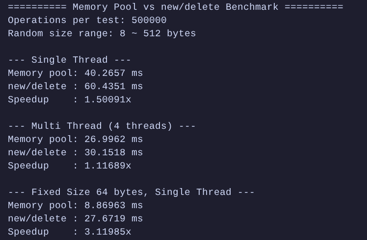

# MemoryPool
## v1版本

这是一个高性能的 C++ 内存池实现，采用固定大小槽位 + 空闲链表的经典设计，专为频繁分配/释放小对象的场景优化。小对象（8-16 字节）的分配速度可达标准 new/delete 的 3-6 倍。

### 核心特性
- 多级槽位：支持 8B ~ 512B 的 64 种槽位大小，步长 8 字节

- O(1) 分配/释放：空闲链表头插法，常数时间复杂度

- 嵌入式指针：空闲槽位复用自身内存存储链表指针，零额外内存开销

- 连续内存块：批量向系统申请，缓存友好

- 对齐优化：自动对齐校正，确保槽位满足最严格的对齐要求

- 编译期优化：模板封装将槽位索引计算移至编译期，消除运行时开销

- 线程安全：细粒度双重检查锁定（可选的互斥锁保护）

### 内存布局

```test

┌─────────────────────────────────────────────────────────────────┐
│                      内存块 (Block)                              │
├──────────┬──────────────┬──────────────┬──────────────┬─────────┤
│ next指针 │   Slot 0     │   Slot 1     │   Slot 2     │   ...   │
│ (8字节)  │ (_slot_size) │ (_slot_size) │ (_slot_size) │         │
└──────────┴──────────────┴──────────────┴──────────────┴─────────┘
     ▲            ▲
 _first_block  _cur_pos

```

### 基本用法

```cpp
#include <v1/memory_pool.h>

int main() {
    // 初始化内存池
    mp::HashBucket::init();
    
    // 方式1：使用模板辅助函数（推荐）
    auto p1 = mp::new_element<uint64_t>(20);
    mp::delete_element(p1);
    
    // 方式2：直接使用原始内存
    void* p2 = mp::HashBucket::use_memory(16);
    mp::HashBucket::free_memory(p2, 16);
    
    // 方式3：直接操作特定槽位池（最快）
    auto& pool = mp::HashBucket::get_memory_pool(0); // 8字节池
    void* p3 = pool.allocate();
    pool.deallocate(p3);
    
    return 0;
}
```

### 性能测试

操作	内存池	new/delete	加速比
纯分配	10ms	 97ms	      9.7x
纯释放	12ms	 55ms	      4.6x
总体	    22ms	152ms	     6.9x

```text
纯分配性能对比：
内存池:  ██ (10ms)
new:    ████████████████████████ (97ms)

纯释放性能对比：
内存池:  ████ (12ms)
delete: █████████████████ (55ms)

总体：
内存池:  ███████ (22ms)
new/del:█████████████████████████████████ (152ms)
```

### 不足
当开启-O2优化之后,由于new/delete在-O2情况下编译器直接内联,MemoryPool速度不及new/delete.


## v2版本

### 概述

v2 是一个**多级缓存内存池**，采用类似 tcmalloc 的设计思想，通过线程本地缓存（ThreadCache）和全局中心缓存（CentralCache）的结合，大幅减少多线程环境下的锁竞争，同时保留批量分配/释放机制，使内存操作效率接近无锁状态。v2 支持任意大小（≤256KB）的内存分配，并自动回退到 `malloc`/`free` 处理超大对象。

### 核心架构

```text
┌─────────────┐     ┌─────────────┐     ┌─────────────┐
│ ThreadCache │     │ ThreadCache │ ... │ ThreadCache │   (每个线程独立)
│   (本地)    │     │   (本地)    │     │   (本地)    │
└──────┬──────┘     └──────┬──────┘     └──────┬──────┘
       │                   │                   │
       └───────────────────┼───────────────────┘
                           ▼
                   ┌─────────────┐
                   │CentralCache │  (全局单例，每个大小类一把自旋锁)
                   │  (中心缓存) │
                   └──────┬──────┘
                          ▼
                   ┌─────────────┐
                   │ PageCache   │  (全局单例，管理 Span)
                   │  (页缓存)   │
                   └─────────────┘
```

### 1. ThreadCache（线程缓存）

- **thread_local 单例**：每个线程独立拥有，分配/释放无锁。
- **空闲链表数组**：`_free_list[FREE_LIST_SIZE]`，每个条目对应一个固定大小类（8 字节对齐，最大 256KB）。
- **批量操作**：当本地链表为空时，从 CentralCache 批量获取（batch_num 根据大小动态计算，最多 4KB）；当本地链表过长（>64）时，批量归还一半给 CentralCache。
- **嵌入式指针**：空闲块的前 8 字节用作 `next` 指针，无额外内存开销。

### 2. CentralCache（中心缓存）

- **全局单例**：所有线程共享，每个大小类独立维护一个原子链表 `_central_free_list`。
- **自旋锁**：每个大小类一把自旋锁，避免全局锁竞争。
- **Span 管理**：当中心缓存为空时，向 PageCache 申请一个 Span（默认 8 页 = 32KB），将其切成小块后，部分返回给 ThreadCache，剩余挂在中心链表上。

### 3. PageCache（页缓存）

- **全局单例**：管理以 Span（连续若干页）为单位的大块内存。
- **Span 结构**：包含起始地址、页数、`next` 指针（用于相同页数的空闲链表）。
- **分配策略**：按页数大小在 `_free_spans`（`std::map<size_t, Span*>`）中查找最小可满足的空闲 Span；若没有则向系统申请（`mmap`）。
- **合并机制**：释放 Span 时，通过 `_span_map`（`std::map<void*, Span*>`）查找前后相邻的 Span，若空闲则合并，减少内存碎片。

### 基本用法

```cpp
#include "v2/thread_cache.hpp"

int main() {
    // 获取当前线程的 ThreadCache 实例
    mp::ThreadCache* tc = mp::ThreadCache::get_instance();

    // 分配内存（大小自动对齐到 8 的倍数）
    void* p1 = tc->allocate(64);    // 64 字节
    void* p2 = tc->allocate(128);   // 128 字节

    // 使用内存
    *(int*)p1 = 42;

    // 释放内存（必须传入原始大小）
    tc->deallocate(p1, 64);
    tc->deallocate(p2, 128);

    // 超大对象自动走 malloc/free
    void* large = tc->allocate(512 * 1024);
    tc->deallocate(large, 512 * 1024);

    return 0;
}
```

### 性能测试

- -O0优化

| 场景 | 内存池(v2) | new/delete | 加速比 |
| ---- | ---------- | ---------- | ------ |
|    单线程随机大小 (8~256) |5.28 ms|7.48 ms|1.42x |
|4 线程随机大小	|3.84 ms	|4.16 ms|	1.08x|
|单线程固定 64 字节|	2.81 ms	|3.14 ms|	1.12x|

- -O2优化

| 场景 | 内存池(v2) | new/delete | 加速比 |
| ---- | ---------- | ---------- | ------ |
|    单线程随机大小 (8~256) |41.07 ms|63.00 ms|1.53x |
|4 线程随机大小	|25.22 ms	|29.83 ms|	1.18x|
|单线程固定 64 字节|	8.95 ms	|27.83 ms|	3.10x|



> 为了方便测试,在v2/central_cache.hpp使用了`#define private public`的代码,正常使用可以去除.